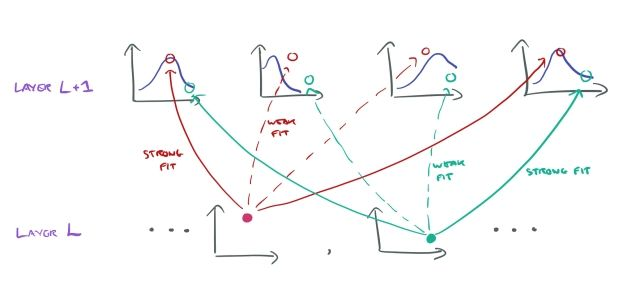
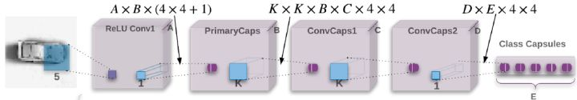

## MATRIX CAPSULES WITH EM ROUTING

- 地址：[https://openreview.net/pdf?id=HJWLfGWRb](https://link.zhihu.com/?target=https%3A//openreview.net/pdf%3Fid%3DHJWLfGWRb)
- 作者：Geoffrey Hinton, Sara Sabour, Nicholas Frosst
- 机构：Google Brain
- 发表：ICLR 2018 Oral

Matrix Capsules 是Hinton的第二个Capsule的实现版本，与前一个版本的区别在于:

1. 胶囊的结构由一个Vector变成包含两部分（Activation 和 Pose Matrix）
2. 动态规划路由，改成了EM Routing by Agreement
3. 网络结构加深了。

实验结果：在Minist数据集上，亲自跑了一下（99.2%），不如上一个版本（99.5%），可能实现也有问题，在smallNORB数据集上SOTA成绩。

### 作者动机

CNN是基于这样一个简单事实：一个视觉系统需要在同一张图片上的所有位置使用相同的知识（Knowledge），CNN通过权重共享来实现这一目的。

观察角度的变化，会给基于像素的图像带来很大的变化，但是对于object与viewer的姿态矩阵（Pose Matrix）来说只是简单的线性影响。胶囊网络想解决视角变化这样的问题，那么卷积胶囊（Convolutional Capsules），不仅需要共享位置（locations）知识，还需要共享整体与局部的关系的知识。

**摘要**

一个胶囊是一组神经元，它的输出代表同一个实体的多个不同属性。胶囊网络的每一层都包含多个胶囊。

提出一种版本的胶囊，每个胶囊包含一个逻辑单元（用来表示实体是否存在）和一个4*4的矩阵（Pose Matrix）用来学习实体与观察者的关系。


> 为什么不再使用Vector Length来表示实体是否存在，A consequence though is that this “*prevents there from being any sensible objective function that is minimized by the iterative routing procedure*”.

L层的胶囊为L+1层的胶囊们的Pose Matrix （M）进行投票（Votes, V），通过把自己的Pose Matrix 与一个viewpoint-invariant 的转换矩阵（W）相乘的方法，转换矩阵可以学习局部与整体的关系特征。

$V_{ij} = M_i*W_{ij}$

这些Votes根据分配系数（assignment coefficient）进行加权，而 coefficient 通过 EM算法进行迭代更新。 转换矩阵 are trained discriminatively by **backpropagating** through the unrolled iterations of EM between 每对相邻胶囊层。

胶囊网络相较于CNN，显示了 far more resistance to white box adversarial attacks 。

**EM ROUTING-BY-AGREEMENT**

我们假设我们已经决定某一层的所有胶囊的poses和activations的概率，我们现在想要决定在上一层中激活哪些胶囊，并且如何将每个active 的低层胶囊分配给一个active 的高层胶囊。 每个高层的胶囊符合高斯分布，每个低层active 胶囊的pose（转换为向量）对应一个数据点 （或对应于一部分的数据点，如果胶囊是部分活跃）。

作者认为高层中的每个胶囊符合高斯分布，并将每个低层胶囊的输出视为数据点。 那么任务基本上变得找出由下层胶囊产生的数据点与由较高层高斯定义的函数之间的拟合。



图片来自于：https://blog.acolyer.org/2017/11/14/matrix-capsules-with-em-routing/


对 $ P_{i|j}^h$ 取对数，对数似然估计，则有下面的转换。


EM Routing 过程


```python
class ConvCaps(nn.Module):
    r"""Create a convolutional capsule layer
    that transfer capsule layer L to capsule layer L+1
    by EM routing.

    Args:
        B: input number of types of capsules
        C: output number on types of capsules
        K: kernel size of convolution
        P: size of pose matrix is P*P
        stride: stride of convolution
        iters: number of EM iterations
        coor_add: use scaled coordinate addition or not
        w_shared: share transformation matrix across w*h.

    Shape:
        input:  (*, h,  w, B*(P*P+1))
        output: (*, h', w', C*(P*P+1))
        h', w' is computed the same way as convolution layer
        parameter size is: K*K*B*C*P*P + B*P*P
    """
    def __init__(self, B=32, C=32, K=3, P=4, stride=2, iters=3,
                 coor_add=False, w_shared=False):
        super(ConvCaps, self).__init__()
        # TODO: lambda scheduler
        # Note that .contiguous() for 3+ dimensional tensors is very slow
        self.B = B
        self.C = C
        self.K = K
        self.P = P
        self.psize = P*P
        self.stride = stride
        self.iters = iters
        self.coor_add = coor_add
        self.w_shared = w_shared
        # constant
        self.eps = 1e-8
        self._lambda = 1e-03
        self.ln_2pi = torch.cuda.FloatTensor(1).fill_(math.log(2*math.pi))
        # params
        # Note that \beta_u and \beta_a are per capsule type,
        self.beta_u = nn.Parameter(torch.zeros(C))
        self.beta_a = nn.Parameter(torch.zeros(C))
        # Note that the total number of trainable parameters between
        # two convolutional capsule layer types is 4*4*k*k
        # and for the whole layer is 4*4*k*k*B*C,
        # which are stated at https://openreview.net/forum?id=HJWLfGWRb&noteId=r17t2UIgf
        self.weights = nn.Parameter(torch.randn(1, K*K*B, C, P, P))
        # op
        self.sigmoid = nn.Sigmoid()
        self.softmax = nn.Softmax(dim=2)

    def m_step(self, a_in, r, v, eps, b, B, C, psize):
        """
            \mu^h_j = \dfrac{\sum_i r_{ij} V^h_{ij}}{\sum_i r_{ij}}
            (\sigma^h_j)^2 = \dfrac{\sum_i r_{ij} (V^h_{ij} - mu^h_j)^2}{\sum_i r_{ij}}
            cost_h = (\beta_u + log \sigma^h_j) * \sum_i r_{ij}
            a_j = logistic(\lambda * (\beta_a - \sum_h cost_h))

            Input:
                a_in:      (b, C, 1)
                r:         (b, B, C, 1)
                v:         (b, B, C, P*P)
            Local:
                cost_h:    (b, C, P*P)
                r_sum:     (b, C, 1)
            Output:
                a_out:     (b, C, 1)
                mu:        (b, 1, C, P*P)
                sigma_sq:  (b, 1, C, P*P)
        """
        r = r * a_in
        r = r / (r.sum(dim=2, keepdim=True) + eps)
        r_sum = r.sum(dim=1, keepdim=True)
        coeff = r / (r_sum + eps)
        coeff = coeff.view(b, B, C, 1)

        mu = torch.sum(coeff * v, dim=1, keepdim=True)
        sigma_sq = torch.sum(coeff * (v - mu)**2, dim=1, keepdim=True) + eps

        r_sum = r_sum.view(b, C, 1)
        sigma_sq = sigma_sq.view(b, C, psize)
        cost_h = (self.beta_u.view(C, 1) + torch.log(sigma_sq.sqrt())) * r_sum

        a_out = self.sigmoid(self._lambda*(self.beta_a - cost_h.sum(dim=2)))
        sigma_sq = sigma_sq.view(b, 1, C, psize)

        return a_out, mu, sigma_sq

    def e_step(self, mu, sigma_sq, a_out, v, eps, b, C):
        """
            ln_p_j = sum_h \dfrac{(\V^h_{ij} - \mu^h_j)^2}{2 \sigma^h_j}
                    - sum_h ln(\sigma^h_j) - 0.5*\sum_h ln(2*\pi)
            r = softmax(ln(a_j*p_j))
              = softmax(ln(a_j) + ln(p_j))

            Input:
                mu:        (b, 1, C, P*P)
                sigma:     (b, 1, C, P*P)
                a_out:     (b, C, 1)
                v:         (b, B, C, P*P)
            Local:
                ln_p_j_h:  (b, B, C, P*P)
                ln_ap:     (b, B, C, 1)
            Output:
                r:         (b, B, C, 1)
        """
        ln_p_j_h = -1. * (v - mu)**2 / (2 * sigma_sq)  - torch.log(sigma_sq.sqrt())  - 0.5*self.ln_2pi
        ln_ap = ln_p_j_h.sum(dim=3) + torch.log(a_out.view(b, 1, C))
        r = self.softmax(ln_ap)
        return r

    def caps_em_routing(self, v, a_in, C, eps):
        """
            Input:
                v:         (b, B, C, P*P)
                a_in:      (b, C, 1)
            Output:
                mu:        (b, 1, C, P*P)
                a_out:     (b, C, 1)

            Note that some dimensions are merged
            for computation convenient, that is
            `b == batch_size*oh*ow`,
            `B == self.K*self.K*self.B`,
            `psize == self.P*self.P`
        """
        b, B, c, psize = v.shape
        assert c == C
        assert (b, B, 1) == a_in.shape

        r = torch.cuda.FloatTensor(b, B, C).fill_(1./C)

        for iter_ in range(self.iters):
            a_out, mu, sigma_sq = self.m_step(a_in, r, v, eps, b, B, C, psize)
            if iter_ < self.iters - 1:
                r = self.e_step(mu, sigma_sq, a_out, v, eps, b, C)

        return mu, a_out

    def add_pathes(self, x, B, K, psize, stride):
        """
            Shape:
                Input:     (b, H, W, B*(P*P+1))
                Output:    (b, H', W', K, K, B*(P*P+1))
        """
        b, h, w, c = x.shape
        assert h == w
        assert c == B*(psize+1)
        oh = ow = int((h - K + 1) / stride)
        idxs = [[(h_idx + k_idx) \
                for k_idx in range(0, K)] \
                for h_idx in range(0, h - K + 1, stride)]
        x = x[:, idxs, :, :]
        x = x[:, :, :, idxs, :]
        x = x.permute(0, 1, 3, 2, 4, 5).contiguous()
        return x, oh, ow

    def transform_view(self, x, w, C, P, w_shared=False):
        """
            For conv_caps:
                Input:     (b*H*W, K*K*B, P*P)
                Output:    (b*H*W, K*K*B, C, P*P)
            For class_caps:
                Input:     (b, H*W*B, P*P)
                Output:    (b, H*W*B, C, P*P)
        """
        b, B, psize = x.shape
        assert psize == P*P

        x = x.view(b, B, 1, P, P)
        if w_shared:
            hw = int(B / w.size(1))
            w = w.repeat(1, hw, 1, 1, 1)

        w = w.repeat(b, 1, 1, 1, 1)
        x = x.repeat(1, 1, C, 1, 1)
        v = torch.matmul(x, w)
        v = v.view(b, B, C, P*P)
        return v

    def add_coord(self, v, b, h, w, B, C, psize):
        """
            Shape:
                Input:     (b, H*W*B, C, P*P)
                Output:    (b, H*W*B, C, P*P)
        """
        assert h == w
        v = v.view(b, h, w, B, C, psize)
        coor = torch.arange(h, dtype=torch.float32) / h
        coor_h = torch.cuda.FloatTensor(1, h, 1, 1, 1, self.psize).fill_(0.)
        coor_w = torch.cuda.FloatTensor(1, 1, w, 1, 1, self.psize).fill_(0.)
        coor_h[0, :, 0, 0, 0, 0] = coor
        coor_w[0, 0, :, 0, 0, 1] = coor
        v = v + coor_h + coor_w
        v = v.view(b, h*w*B, C, psize)
        return v

    def forward(self, x):
        b, h, w, c = x.shape
        if not self.w_shared:
            # add patches
            x, oh, ow = self.add_pathes(x, self.B, self.K, self.psize, self.stride)

            # transform view
            p_in = x[:, :, :, :, :, :self.B*self.psize].contiguous()
            a_in = x[:, :, :, :, :, self.B*self.psize:].contiguous()
            p_in = p_in.view(b*oh*ow, self.K*self.K*self.B, self.psize)
            a_in = a_in.view(b*oh*ow, self.K*self.K*self.B, 1)
            v = self.transform_view(p_in, self.weights, self.C, self.P)

            # em_routing
            p_out, a_out = self.caps_em_routing(v, a_in, self.C, self.eps)
            p_out = p_out.view(b, oh, ow, self.C*self.psize)
            a_out = a_out.view(b, oh, ow, self.C)
            out = torch.cat([p_out, a_out], dim=3)
        else:
            assert c == self.B*(self.psize+1)
            assert 1 == self.K
            assert 1 == self.stride
            p_in = x[:, :, :, :self.B*self.psize].contiguous()
            p_in = p_in.view(b, h*w*self.B, self.psize)
            a_in = x[:, :, :, self.B*self.psize:].contiguous()
            a_in = a_in.view(b, h*w*self.B, 1)

            # transform view
            v = self.transform_view(p_in, self.weights, self.C, self.P, self.w_shared)

            # coor_add
            if self.coor_add:
                v = self.add_coord(v, b, h, w, self.B, self.C, self.psize)

            # em_routing
            _, out = self.caps_em_routing(v, a_in, self.C, self.eps)

        return out
```


**网络结构**



```php
class CapsNet(nn.Module):
    """A network with one ReLU convolutional layer followed by
    a primary convolutional capsule layer and two more convolutional capsule layers.

    Suppose image shape is 28x28x1, the feature maps change as follows:
    1. ReLU Conv1
        (_, 1, 28, 28) -> 5x5 filters, 32 out channels, stride 2 with padding
        x -> (_, 32, 14, 14)
    2. PrimaryCaps
        (_, 32, 14, 14) -> 1x1 filter, 32 out capsules, stride 1, no padding
        x -> pose: (_, 14, 14, 32x4x4), activation: (_, 14, 14, 32)
    3. ConvCaps1
        (_, 14, 14, 32x(4x4+1)) -> 3x3 filters, 32 out capsules, stride 2, no padding
        x -> pose: (_, 6, 6, 32x4x4), activation: (_, 6, 6, 32)
    4. ConvCaps2
        (_, 6, 6, 32x(4x4+1)) -> 3x3 filters, 32 out capsules, stride 1, no padding
        x -> pose: (_, 4, 4, 32x4x4), activation: (_, 4, 4, 32)
    5. ClassCaps
        (_, 4, 4, 32x(4x4+1)) -> 1x1 conv, 10 out capsules
        x -> pose: (_, 10x4x4), activation: (_, 10)

        Note that ClassCaps only outputs activation for each class

    Args:
        A: output channels of normal conv
        B: output channels of primary caps
        C: output channels of 1st conv caps
        D: output channels of 2nd conv caps
        E: output channels of class caps (i.e. number of classes)
        K: kernel of conv caps
        P: size of square pose matrix
        iters: number of EM iterations
        ...
    """
    def __init__(self, A=32, B=32, C=32, D=32, E=10, K=3, P=4, iters=3):
        super(CapsNet, self).__init__()
        self.conv1 = nn.Conv2d(in_channels=1, out_channels=A, kernel_size=5, stride=2, padding=2)
        self.bn1 = nn.BatchNorm2d(num_features=A, eps=0.001, momentum=0.1, affine=True)
        self.relu1 = nn.ReLU(inplace=False)
        self.primary_caps = PrimaryCaps(A, B, 1, P, stride=1)
        self.conv_caps1 = ConvCaps(B, C, K, P, stride=2, iters=iters)
        self.conv_caps2 = ConvCaps(C, D, K, P, stride=1, iters=iters)
        self.class_caps = ConvCaps(D, E, 1, P, stride=1, iters=iters, coor_add=True, w_shared=True)

    def forward(self, x):
        x = self.conv1(x)
        x = self.bn1(x)
        x = self.relu1(x)
        x = self.primary_caps(x)
        x = self.conv_caps1(x)
        x = self.conv_caps2(x)
        x = self.class_caps(x)
        return x
```

实现来自：[https://github.com/yl-1993/Matrix-Capsules-EM-PyTorch](https://link.zhihu.com/?target=https%3A//github.com/yl-1993/Matrix-Capsules-EM-PyTorch)

**Spread Loss**

为了使训练过程对模型的初始化以及超参的设定 没那么敏感，作者采用传播损失函数来最大化 被激活的目标类与被激活的非目标类之间的间距。$ a_t $ 表示target的激活值，$ a_i $表示Class Capsules中除t外第i个的激活值。

$ L_i = (max(0, m-(a_t - a_i))^2, L = \sum_{i\ne t} L_{i}$

将m从0.2的小幅度开始，在训练期间将其线性增加到0.9，从而避免无用胶囊的存在。